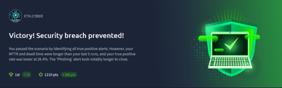
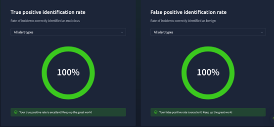

# SOC Simulator – Threat Analysis & Incident Response

**Platform:** ETH.CYBER  
**Date:** September 2025  
**Author:** Hamzah Ali Al-Haidari  

## Overview
This project documents my experience working on a SOC Simulator, a realistic cybersecurity analyst environment designed to enhance threat intelligence and incident response skills.

## Tools Used
- **Splunk SIEM** – centralized log collection and analysis  
- **Wireshark** – network traffic analysis  
- **PowerShell** – automation and incident investigation  
- **VirusTotal** – file and URL reputation analysis  

## Project Description
In this simulation, I:
- Analyzed alerts in real-time and classified them as malicious or benign  
- Investigated phishing campaigns and suspicious process relationships  
- Correlated digital evidence to determine attack sources and response strategies  
- Prepared AI-reviewed incident reports highlighting IOCs and mitigation actions  

## Results & Skills Gained
- Achieved 100% accuracy in identifying true positives and false positives  
- Managed and resolved 21 alerts with a mean response time of 3 minutes  
- Strengthened skills in **digital forensics, technical analysis, and real-time incident response**  

**Key Metrics:**
- **True Positive Identification Rate:** 100%  
- **False Positive Identification Rate:** 100%  
- **Mean Time to Resolve Alerts:** 3 minutes  
- **Mean Dwell Time:** 34 minutes  

## File Structure
- `PDF/` – Full project report  
- `images/` – Scenario screenshots  
 

## Summary
This SOC Simulator project enhanced my hands-on skills in real-time threat detection, incident response, and digital forensics. It provided practical experience in a dynamic SOC environment, improving my technical analysis and investigative abilities.

## License
This project is for educational purposes and open for review and learning.
